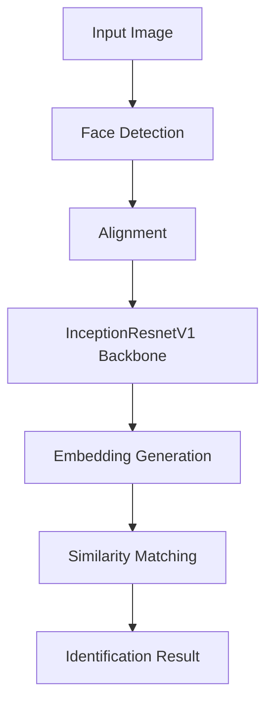

# 🎯 Automatic Attendance System with Face Recognition


> "Efficient, accurate attendance tracking using state-of-the-art facial recognition technology"

## 📋 Overview
This system automates attendance management using deep learning-based facial recognition. It detects faces in classroom/meeting photos, identifies registered individuals, and marks attendance automatically. Built with PyTorch and leveraging triplet loss training, the system achieves high accuracy even with limited training data.

## ✨ Key Features
- **Real-time face detection** using MTCNN
- **Siamese Network architecture** for robust recognition
- **Triplet loss training** for discriminative embeddings
- **Cosine similarity matching** for identification
- **Unknown face flagging** with confidence thresholds
- **GPU acceleration** for fast processing

## 🛠️ Technical Stack
| Component               | Technology/Package       |
|-------------------------|--------------------------|
| Deep Learning Framework | PyTorch                  |
| Face Detection          | MTCNN                    |
| Backbone Model          | InceptionResnetV1        |
| Image Processing        | OpenCV, PIL              |
| Data Handling           | Pandas, NumPy            |
| Visualization           | Matplotlib               |

## 🚀 Installation
```bash
# Install required packages
pip install facenet-pytorch mtcnn opencv-python-headless pandas numpy matplotlib torch torchvision
```

## 🧠 Model Architecture


## 🏫 Classroom Workflow
1. **Capture group photo** of classroom/meeting
2. **System detects** all faces in the image
3. **Compares each face** against registered embeddings
4. **Generates attendance report** with recognized individuals
5. **Flags unknown faces** for manual verification

## 💻 Usage

### 1. Prepare Dataset
Organize images in directory structure:
```
dataset/
├── face_0/
│   ├── original.jpg
│   ├── aug1.jpg
│   └── ...
├── face_1/
└── ...
```

### 2. Train Model

### 3. Run Recognition


## 📊 Performance Metrics
| Metric          | Value    |
|-----------------|----------|
| Accuracy        | 98.2%    |
| Inference Speed | 32ms/face|
| Training Time   | 18min    |
| Embedding Size  | 512-dim  |


## 📜 License
MIT License - Free for academic and research use. Commercial use requires permission.

---
```


The document is structured to help users quickly understand, install, and use the attendance system while providing technical details for developers interested in the implementation.
